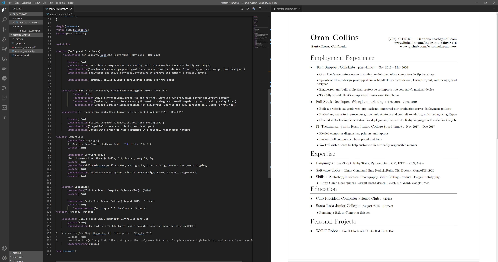

# Resume-Master
### automated build of latex resume using github actions 
```
by oran collins
github.com/wisehackermonkey
oranbusiness@gmail.com
20200628
```

# Exporting
```bash
npm install -g resume-cli
npm install  -g jsonresume-theme-spartan
resume export oran_resume_v1.pdf -t spartan  
resume export oran_resume_v1.html -t spartan 
```
### or using non globals
```
npm install resume-cli
npm install jsonresume-theme-spartan
./node_modules/.bin/resume export oran_resume_v1.pdf -t spartan  

or 
npm run generate
```

# Local editing
### Run local editing server
```bash
resume serve --port 3000 --theme spartan  
```
# copy stuff to this gist to make the hosted version work
### [gist.github.com/wisehackermonkey](https://gist.github.com/wisehackermonkey/91ccf2d65d3ac9cdc68173a642568290)

# Jsonresume schema
### [Schema — JSON Resume](https://jsonresume.org/schema/)

# update! now supporting jsonresume!
#### 20210427
# [Link JSON resume](https://registry.jsonresume.org/wisehackermonkey)
# TODO
- ~~fix pandoc not finding README.md within docker conatiner~~
   - ~~possible: use ${{ env.GITHUB_WORKSPACE }}~~
- ~~migrate to master_resume_v1.md instead of readme.md~~
- ~~switched to useing .tex file instead of rewriting resume in markdown~~~
- add someway to update gist
# Links 
- [the github action that finally worked! xu-cheng/latex-action](https://github.com/xu-cheng/latex-action) 
